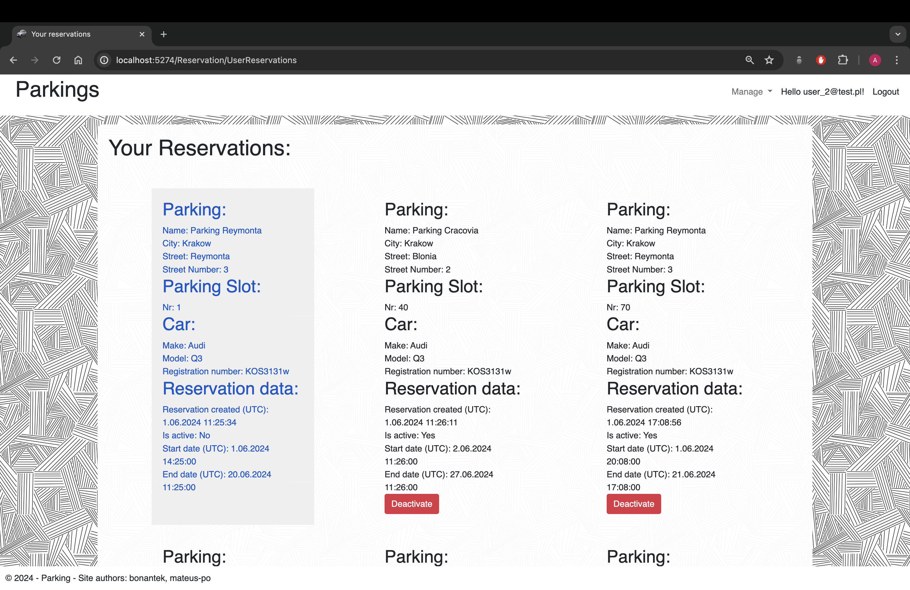
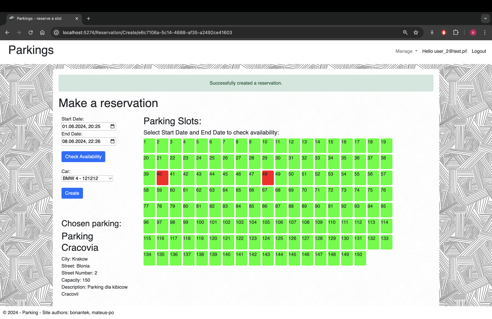
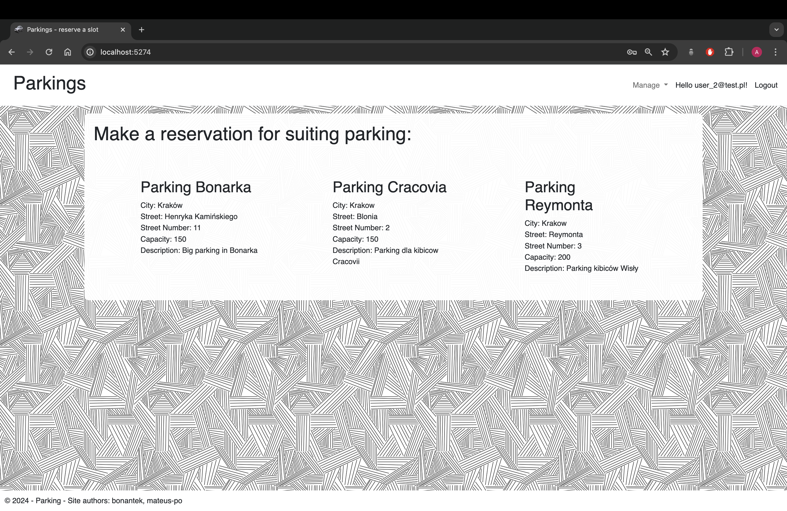
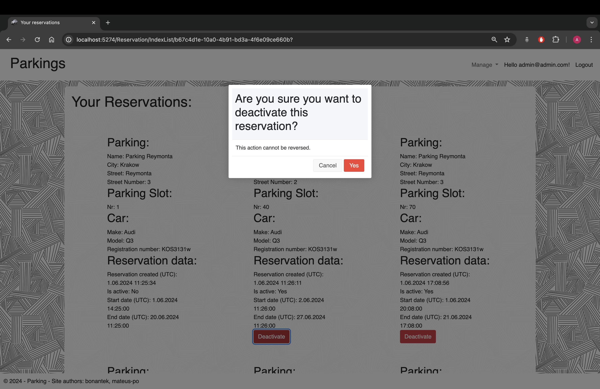
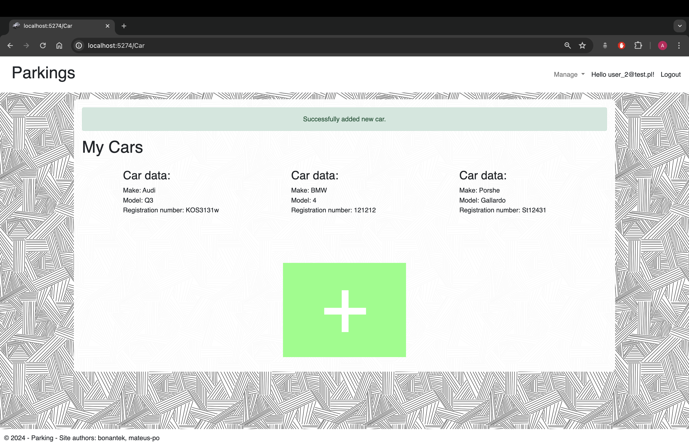
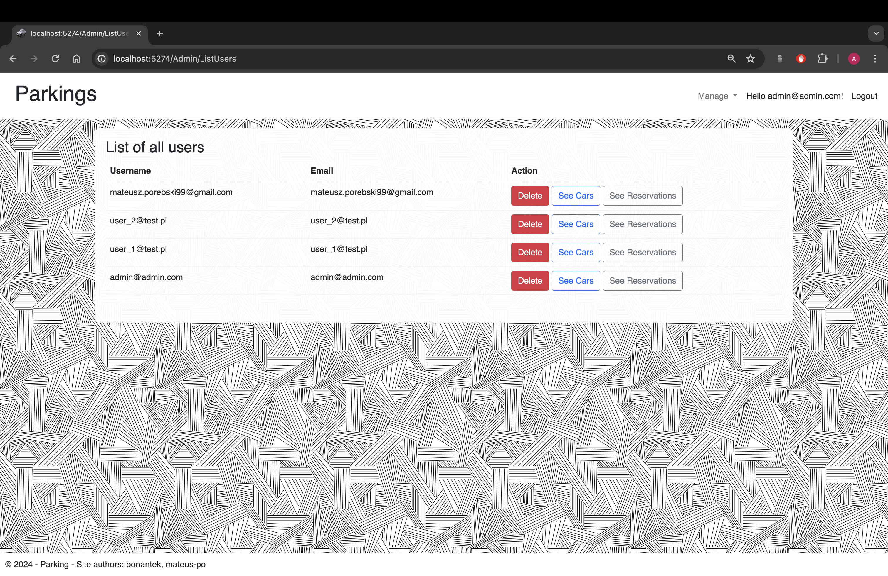
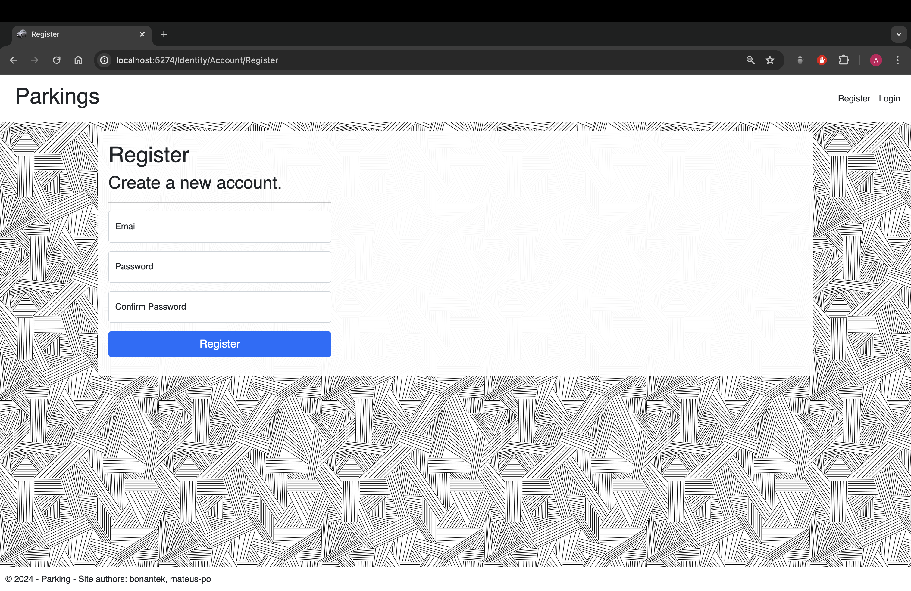

# Parking Reservation System

**Parking** is a project built with ASP.NET Core MVC and ASP.NET Core Identity.
Project created for academic course "Advanced Programming 2"

# Features

- Authentication and authorization (ASP.NET Core Identity)
- User Functionality 
  - Users can make reservations for parking area
  - Users can deactivate their reservations
  - Users can assign reservations to specific cars
  - Users can managing own cars (adding, deleting, updating)
  - Users can manage their credentials, including changing passwords
  
- Admin Functionality
  - Admin can add, edit, and delete specific parking
  - Admin can manage all user reservations
  - Admin can delete users from the system
  - Admin has all features that user has

# Stack 
- ASP.NET Core MVC
- ASP.NET Core Identity
- Entity Framework Core
- SQLite

# Installation

1. Clone repo:
```
git clone git@github.com:bonantek/Parking.git
```
2. Change directory
```
cd Parking
```
3. Install dependencies:

```
dotnet restore
```
4. Update database:
```
dotnet ef database update --project Parking/
```
5. And finally run our application:
```
dotnet run --project Parking
```

# Usage
Visit localhost
```
https://localhost:7260 or http://localhost:5274
```

# Credentials for admin

```
email: admin@admin.com
pass: Test1234!
```
# Screenshots








